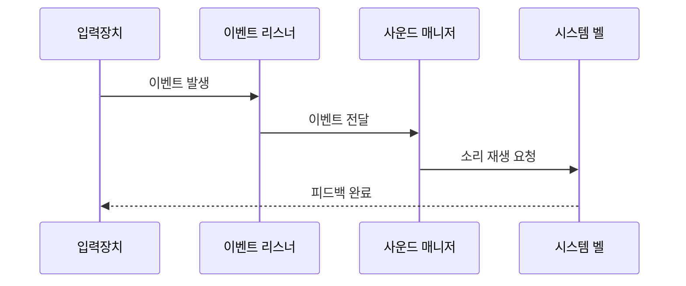

# 🔔 Keypress Notifier

<div align="center">

[](https://www.rust-lang.org/)
[](https://www.linux.org/)

> 🎵 리눅스용 입력 이벤트 사운드 피드백 시스템

</div>

---

## 📋 목차

-   [개요](#-개요)
-   [설치 방법](#-설치-방법)
-   [사용 방법](#-사용-방법)
-   [기술 구조](#️-기술-구조)
-   [문제 해결](#-문제-해결)
-   [FAQ](#-faq)

---

## 📖 개요

Keypress Notifier는 리눅스 시스템에서 입력 이벤트를 감지하고 소리로 피드백을 제공하는 도구입니다.

### 작동 방식


## ✨ 기능

### 핵심 기능

-   🎹 **입력 이벤트 감지**

    -   키보드 입력
    -   마우스 클릭
    -   마우스 이동

-   🔊 **사운드 피드백**
    -   시스템 벨 활용
    -   실시간 응답

## 🚀 설치 방법

### 1. 시스템 요구사항

```yaml
운영체제:
    - Linux (커널 버전 4.0 이상)

필수 패키지:
    - Rust 1.56.0 이상
    - libudev-dev
    - libinput-dev
```

### 2. Rust 설치

```bash
# Rust 설치
curl --proto '=https' --tlsv1.2 -sSf https://sh.rustup.rs | sh

# 설치 확인
rustc --version
cargo --version
```

### 3. 프로젝트 설치

```bash
# 저장소 클론
git clone https://github.com/in-jun/keypress-notifier.git

# 디렉토리 이동
cd keypress-notifier

# 빌드
cargo build --release

# 실행
sudo ./target/release/keypress-notifier
```

## 📱 사용 방법

### 기본 사용

```bash
# 일반 실행
sudo ./keypress-notifier
```

## ⚙️ 기술 구조

### 이벤트 처리 흐름



## 🔍 문제 해결

### 일반적인 문제

| 문제      | 해결 방법        |
| --------- | ---------------- |
| 권한 오류 | `sudo` 사용 확인 |
| 소리 없음 | 시스템 볼륨 확인 |
| 감지 실패 | 장치 권한 확인   |

## 💭 FAQ

**Q: 다른 OS에서도 사용 가능한가요?**

-   A: 현재는 Linux 전용입니다.

**Q: 사용자 정의 소리를 추가할 수 있나요?**

-   A: 현재 버전에서는 시스템 벨만 지원합니다.

**Q: 리소스 사용량은 어떤가요?**

-   A: 매우 가벼우며, 평균 CPU 사용률 1% 미만입니다.

---

<div align="center">

**[맨 위로 올라가기](#-keypress-notifier)**

Made with ❤️ by [in-jun](https://github.com/in-jun)

</div>
